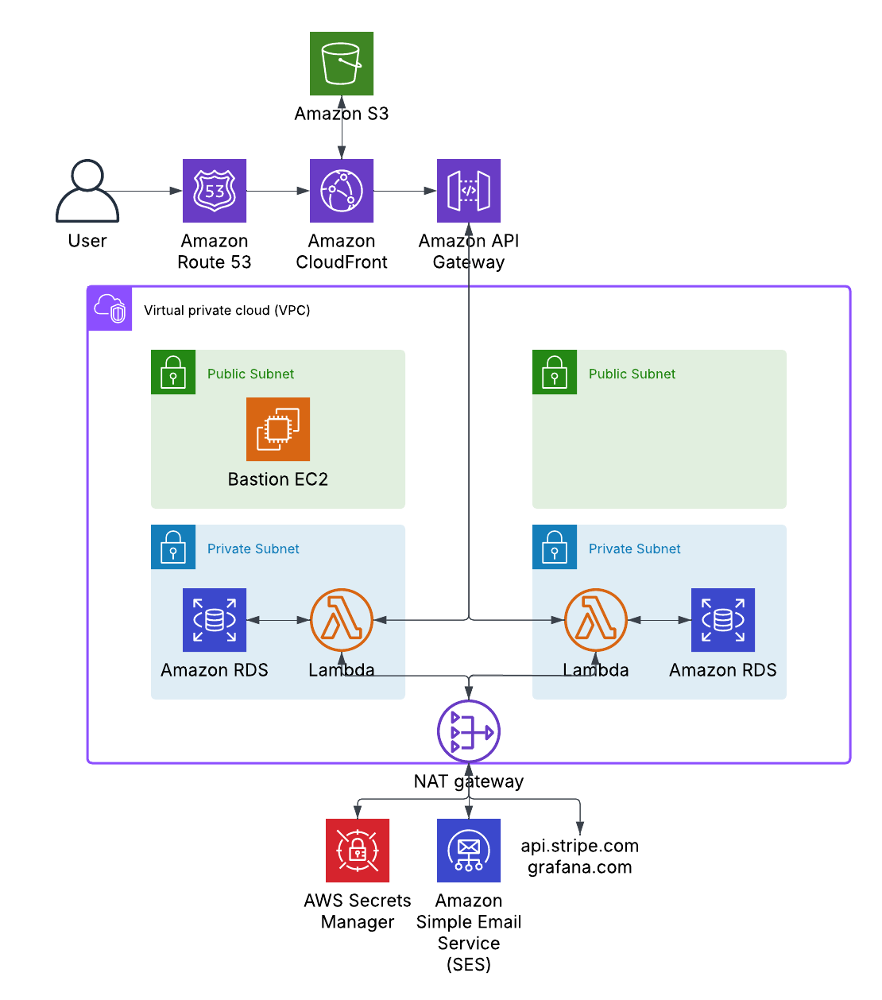

# E-Commerce Application
## Overview
A full stack e-commerce application built to liquidate dead stock for a local business. The application integrates with **Stripe's API** for secure payment processing and features comprehensive user management and inventory tracking systems. It is then hosted on **AWS** and deployed with **Terraform**. Several metrics are shipped to **Grafana cloud** to provide insights into the system, and application's health.

  &nbsp;&nbsp;&nbsp;&nbsp;&nbsp;&nbsp;
  &nbsp;&nbsp;&nbsp;&nbsp;&nbsp;&nbsp;
  &nbsp;&nbsp;&nbsp;&nbsp;&nbsp;&nbsp;
  &nbsp;&nbsp;&nbsp;&nbsp;&nbsp;&nbsp;
  &nbsp;&nbsp;&nbsp;&nbsp;&nbsp;&nbsp;
  &nbsp;&nbsp;&nbsp;&nbsp;&nbsp;&nbsp;
  &nbsp;&nbsp;&nbsp;&nbsp;&nbsp;&nbsp;
  &nbsp;&nbsp;&nbsp;&nbsp;&nbsp;&nbsp;
  

## Infrastructure Diagram

## Component Breakdown 

### Frontend

Emphasis was not placed on developing the frontend as the focus was to deliver a working application as quickly as possible. It provides the minimum required functionality.

  * Single page application built with **Vite.js**, **Hero UI** & **Tailwind CSS**. 
  * Cart management implemented via local storage to persist cart data across page reloads.
  * Admin page only accessible to users with certain UUIDs (Handled via backend).
  * Staggered item loading based on scroll position to reduce network load.
  * Product filtering system. 

### Backend
RESTful API built with Express.js, made compatible with Lambda using serverless-http.
  * Minimal but sufficient user management system, authentication via **JWT**.
  * Order management system for both customers and admins.
  * Automated inventory management.
  * Secure payment system via **Stripe API**.
  * Automated emails via **Amazon Simple Email Service**.

### AWS Infrastructure
The following infrastructure provides a relatively cost effective solution to hosting a serverless 3 tier application, Costing roughly **$1.50-$3.00 per day**.

This set-up previously made use of endpoints however since a NAT gateway was required to provide connection to 3rd party services like Stripe & Grafana, The additional $1.60 required to run the endpoints could be eliminated.

  * Frontend hosted via **S3 Static**, **Route53** & **Cloudfront**.
  * Secured with **WAF** using the following rules: 
    * **AWS Common Rule Set**.
    * SQL Injection Protection.
    * Known Bad Inputs.
    * Rate Limiting.
  * Backend hosted via **API Gateway** & **Lambda**.
  * Database hosted with PostgresSQL on **RDS**.
  * *Optional* bastion host EC2 instance for SSH access. Used initially to populate database & retrieve admin UUID.
  * **VPC**
    * 2 public subnets & 2 private subnets placed across 2 availability zones.
    * NAT gateway to provide Lambda access to Stripe & Grafana.
  * **S3 bucket** for static hosting.
### Grafana
  * Custom metrics scraped from Express API:
    * DB query duration.
    * DB pool size.
    * DB errors.
    * API errors.
    * etc...
  * Various AWS resouce metrics.
  * Alerts created when: 
    * Various CPU metrics exceed thresholds.
    * Query durations take too long.
    * Errors/second exceed theshold.
### Github Actions
The Pipeline only handles deployment as SAST tools require the repository be public. Given I had the means to create a full pipeline it would consist of the following steps:

*  Run SAST scans on front & backend code
*  Run some form of IaC scan, like Sentinel for example, on the Terraform config.
*  Deploy the application to AWS using Terraform.
*  Run the existing build steps:
    * `terraform init > apply`
    * Build frontend with `npx run build`
    * Upload to S3
* Finally run a DAST scan to capture any live vulnerabilities.

## Final Words
The aim of this project was to deliver a full-stack e-commerce platform to help a local business liquidate inventory while showcasing my cloud architecture skills. I designed a cost-efficient (~$1.50-£3.00/day), mostly serverless infrastructure on AWS, featuring S3, Lambda, API Gateway, and RDS, with comprehensive security through WAF protection.

I purposely ommitted a 'Steps to replicate' section as the process requires setting up several third party services. That being said those that wish to use this project for themselves are more than welcome to clone the repository and attempt to replicate the set-up. If you require any guidance in setting it up feel free to reach out to me on GitHub.